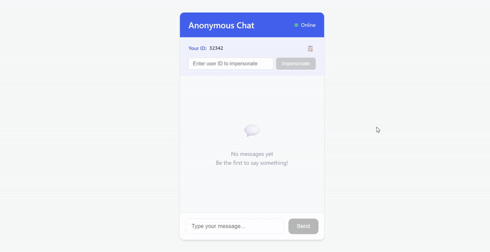

# Анонимный чат

## Установка после клонирования репозитория

### backend
```
cd ra-homeworks-6-3
cd backend
npm install
npm start
```

### frontend
```
cd ra-homeworks-6-3
cd chat
npm install
npm run dev
```



